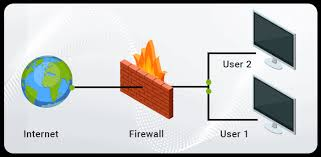
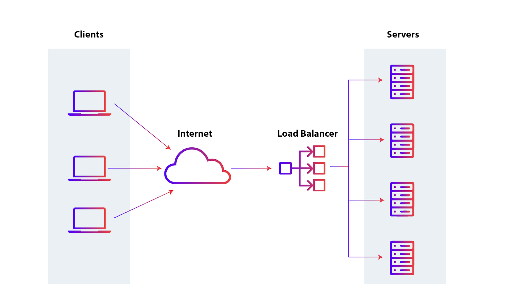

# PATOS/POMBO PSEL 2.0

Tá sempre aberto, só enviar o PR

---

### Hey! Bem vindo(a) a segunda edição do PATOS/POMBO PSEL! **Clap Clap 👏👏**


Durante os quase **dois** primeiros anos do PATOS, este processo de entrada de todos era um unico desafio, a criação de um **reverse proxy**, na prática o que queriamos era entregar algo "baixo nível" que deveria ser feito sem a ajuda de bibliotecas e sem ser nas **linguagens fáceis** como Python ou JavaScript.  
E o objetivo de vocês era justamente receber algo difícil e não tão comum e saber lidar com o "Ok, eu não sei nada disso" principalmente indo para o "Eu não sei nada disso, mas vou aprender, eu não tenho medo de errar e aprender algo novo".

Ficamos muito felizes com o resultado tanto na quantidade de pessoas, quanto na qualidade de cada uma delas. Descobrimos que sim, o processo seletivo funcionou bem e conseguimos trazer pessoas incríveis para o time, que de fato se encaixaram na cultura e no jeito PATOS de ser.  
Ficamos mais felizes ainda que não precisamos também de nenhuma bullshitagem de seleção como dinâmicas de grupo, testes de personalidade, perguntas capciosas ou qualquer outra coisa que não fosse um bom desafio técnico.

Contudo, nós sabiamos que o processo poderia ser melhor. Antes, sendo apenas um desafio específico, deixávamos de lado muitas outras áreas de atuação do PATOS e seus integrantes. Um reverse proxy foca muito em redes que de fato é uma das nossas grandes áreas de atuação, mas e o resto? E o pessoal de Segurança?.. Hardware, SRE, Open Source?  
Além disso, acreditamos que chegamos em um platô (de fato elevado) de qualidade no antigo desafio. Os últimos processos seletivos tiveram uma qualidade de entrega tão alta (diga-se de passagem, enviados todos por bixos) que não saberíamos mais como baixar as expectativas ou aumentar o desafio para mais entregas.

Pensando nisso, resolvemos criar o **PATOS PSEL 2.0**. Um processo seletivo que abrange mais áreas do PATOS e que permite que você escolha o desafio que mais se encaixa com o seu perfil e com a sua vontade de aprender.

----

### Quem pode participar?

TODO O MUNDO! Não importa de bixo a veterano de dentro ou fora da UFSCar, de dia ou noite, nas ferias ou durante as aulas, se você tem vontade de aprender e acha que o PATOS é um lugar onde você pode aprender, se desenvolver e contribuir, esse processo seletivo é pra você!

### O que é o PATOS e POMBO? São a mesma coisa? O processo seletivo é para qual dos dois?

PATOS é o grupo de Open Source da UFSCar, além de ser um grupo de estudos, um grupo de pesquisa, um grupo de desenvolvimento, um grupo de pessoas que se juntam para aprender e contribuir tanto com código tnato com conhecimento. Outra grande frente nossa são os Aulões, onde a gente ensina o que a gente sabe para a comunidade, seja ela interna ou externa.  
Já o POMBO é o grupo de Cibersegurança da UFSCar, sua existencia é anterior ao PATOS, mas hoje em dia é um subgrupo do PATOS, 'a frente' de segurança.  
Este processo seletivo é para ambos, e você pode escolher qualquer desafio para entrar no PATOS, que consequentemente te dá acesso ao POMBO, caso queira participar da frente de segurança.

#### Como funciona a hierarquia no PATOS/POMBO?

Não há, espero ter ajudado 👍!  
Simplesmente não achamos que faça sentido. O PATOS funciona como uma comunidade de pessoas que se juntam para aprender e contribuir (com código, conhecimento, recomendação e memes), não existe "níveis" ou "hierarquia" dentro do grupo, todos são iguais e tem voz ativa desde o dia um.
Além disso, não gostamos da forma engessada e ultrapassada que outros grupos têm, sem contar o tanto de confusão e discórdia que isso gera entre os membros. (Sério que vocês querem receber ordens de outro aluno sem nem receber um salário? Não, obrigado ~Marlon).   
Se você entrar no PATOS saiba que você é membro e no máximo vamos ter um status "bixo" e "veterano", mas isso é só para diferenciar quem entrou recentemente de quem já tem mais tempo, não tem nada a ver com "nível", e você pode levantar a mão puxar algo ou criticar algo também!

#### O que fazemos dentro do PATOS

Uma das coisas que fazemos dentro do PATOS são os aulões que ocorrem durante o ano todo, sem uma data muito fixa. Os temas são variados e livres (mas na maioria das vezes relacionados a projetos open source, redes, segurança, cloud, etc.), e são escolhidos pelos próprios membros. Se você estiver estudando algum tema interessante e decidir que quer expor esse conhecimento publicamente, você pode marcar um aulão pra você sempre que quiser, sobre o tema que quiser.

Além dos aulões, o PATOS também detém uma boa bagagem de participações em Hackatons, tendo ficado no pódio nos 3 últimos Hackatons da SECOMP. Também tivemos um pódio importante em um Hackaton internacional de eBPF, o eBPF Summit 2025, em que 4 integrantes do PATOS formaram um grupo e venceram o hackaton. Dito isso, se você desejar participar de um hackaton, basta mandar no grupo que certamente você irá conseguir fechar um time para competir.

Ainda sobre as competições, o POMBO, a frente de segurança do PATOS, participa de alguns CTFs ao longo do ano, sendo uma boa oportunidade para testar seus conhecimentos de segurança e técnicas de penetração.

Durante a SECOMP, também organizamos um CTF próprio que todos que participam da Semana da Computação podem jogar. Cada membro (que quiser participar da produção de challenges) manda 1, 2 ou mais challenges para compor o CTF da SECOMP.

Finalmente, o PATOS também é um lugar muito propício para ir em eventos de computação, você sempre pode mandar um evento que você deseja ir no grupo e ver se outros membros gostariam de ir com você! As vezes isso facilita muito e barateia os custos já que vocês podem dividir meio de transporte e afins.

Vale mencionar que o PATOS é um grupo bem aberto e isso significa que você pode conversar com os outros membros para fazer qualquer tipo de projeto em grupo, desde que ele seja pertinente e se relacione com os temas de PATOS (Redes, Open Source, Segurança, etc.)

### Quais as vantagens de entrar no PATOS?

#### Experiência

Durante as atividades do grupo você poderá desenvolver diversas habilidades técnicas, por conta dos Hackatons e projetos que acabamos participando, e também soft-skills, devido aos aulões que proporcionamos para a comunidade - construindo uma base sólida para boas apresentações e para uma boa comunicação.

Além disso, os membros grupo sempre estão pesquisando/estudando algum conteúdo novo, fazendo do PATOS um grupo que reúne pessoas focadas em melhorar o próprio repertório intelectual.

#### Você não estará sozinho

Como mencionado alguns parágrafos acima, o PATOS é um grupo que incentiva as atividades em grupo, e dificilmente você não conseguirá fechar um grupo parar fazer algum projeto, pesquisa ou competição que deseje.

#### Networking

Algo que conta bastante para a vida profissional de todo universitário é o Networking, ter uma boa rede de contatos é essencial para se lançar no mercado de trabalho. O PATOS pode te proporcionar um bom networking, haja vista que alguns membros e ex-membros já passaram por grandes nomes como:
- `Google`
- `Red Hat`
- `Von Braun Labs`
- `CERN` (Centro de pesquisas nucleares Europeu)
- `NU`
- `Magalu`
- `Leroy Merlin`

Ou seja, o PATOS é um lugar muito bom para conhecer pessoas bem empregadas e que conhecem bem o mercado de trabalho, e um ótimo lugar para se desenvolver acadêmicamente e profissionalmente.

---

### Como funciona o PATOS/POMBO PSEL 2.0?

Na segunda edição do PATOS PSEL, você poderá escolher entre 4 desafios diferentes, cada um focado em uma área de atuação do PATOS. Os desafios são:

- 1. Segurança & Redes - Firewall simples em UserSpace
- 2. Redes - Load Balancer
- 3. Segurança - Histórico de CTF
- 4. Open Source / Comunidade - Contribuição para um projeto open source

#### O que esperamos
- Pesquise, saiba lidar com problemas dificeis e busque aprender coisas novas
- O PSEL foi pensado pra ser uma jornada, e não um simples desafio de código, por isso, nós gostaríamos que você nos mostrasse seu processo de aprendizado e os desafios que você enfrentou durante ele.
  
---

### 1. Segurança & Redes - Firewall simples em UserSpace

Você deve fazer um firewall em userspace do **zero**, lidando com o recebimento e filtragem de pacotes, tudo isso na mão, sem usar qualquer lib que abstraia demais o código. Você deve fazer com que o seu firewall atue em um IP diferente do IP da sua máquina, criando uma interface de rede virtual (TUN) e roteando o trafego de uma sub-rede inteira (ex: 10.0.0.x/24) para ela.

Para que você tenha uma ideia geral do que é um firewall, separamos esta imagem:



Você não pode utilizar linguagens que abstraiam demais o seu código, ou seja: nada de python e javascript. Exemplo (a não ser seguido):

```python
from pyfire import Firewall

firewall = Firewall(ip)

firewall.ban(word_list)
firewall.ban(ip)
```

 Nós particularmente recomendamos as seguintes linguagens:
- `C/C++`
- `ASM`
- `Go`
- `Rust`
- `Zig`
- `Clojure`
- `Erlang`
- Qualquer outra desde que **não** tenha muita coisa pronta.

Este desafio tem como objetivo testar a resiliência de vocês em aprender novas tecnologias e o quão longe vocês estão dispostos a ir começando do zero.

> Você só deve utilizar libs que são ESSENCIAIS para o funcionamento do seu projeto, e que não vão abstrair nenhum código relacionado ao funcionamento do firewall.

Os seguintes tópicos serão os principais **pontos de avaliação** do seu projeto:

- **Funcionamento em cima de um IP específico, diferente do IP da sua máquina**
- **Filtragem e resposta de PING (ICMP)**
    - Deve bloquear pelo menos um destino da sub-rede de receber qualquer pacote (ex: 10.0.0.2 e 10.0.0.3, recebem pacotes, já 10.0.0.50 não recebe pacote nenhum)
    - Deve responder ao ping efetuado por outro terminal

- **Filtragem de pacotes UDP**
    - Deve filtrar pacotes UDP recebidos baseado em uma lista de palavras proibídas

- **Filtragem de pacotes TCP**
    - Deve filtrar pacotes TCP recebidos baseado em uma lista de palavras proibídas

- Documentação
- Colaboração
    - Tente disponibilizar as fontes de pesquisa que você utilizou para construir seu projeto
- Organização e Versionamento de Código
- Experiência num geral. Não é só um código

Além disso, existem alguns diferênciais para este projeto que você pode tentar fazer (sendo completamente opcionais):
- Logs customizadas para cada interação no terminal
- Exibição do conteúdo dos pacotes (payload) caso existam
- Three-Way Handshake do TCP (SYN e SYN-ACK)
- Forjar pacotes ACK para aceitação e RST para rejeição de pacotes maliciosos.

Se você desejar inserir um diferencial diferente dos citados acima, sinta-se livre para fazer isso! Nós recomendamos fortemente que você não se limite a fazer apenas o que nós pedimos.

Você pode usar IA, mas caso você utilize, use com sabedoria, lembre-se que faremos perguntas técnicas sobre seu código durante a entrevista.

Outro ponto importante: nós queremos acompanhar o seu processo de aprendizado enquanto você faz o PSEL, então tente fazer commits sempre que você conseguir fazer algum progresso, grande ou pequeno!

``O código deve ser entregue em um repositório do github, no caso, um fork deste repositório aqui. Quando tudo estiver finalizado, abra um pull request para a branch main, e seu projeto estará entregue. Lembre-se de adicionar um README.md``

Se você tiver feito tudo corretamente e seu código for aprovado, você terá uma fase de entrevista, comum a todos os 4 desafios deste processo seletivo.

Finalmente, tenha em mente que:
- Você pode e deve contatar qualquer membro do PATOS em caso de dúvidas sobre o PSEL.
- Você pode deixar sua dúvida pública para outras pessoas que desejam fazer o PSEL mandando-a em [Issues](https://github.com/patos-ufscar/psel/issues)
- Não se sinta pressionado a fazer tudo, foque no que se sente confortável.
- Envie mesmo se não conseguir todas as partes essenciais, documente suas dificuldades.
- No seu README descreva como foi fazer o processo seletivo, o que você aprendeu, etc. **Documente sua jornada**.

``Boa sorte!``

> Lembrando que o processo é pra ser bem de boa, queremos ver até onde conseguem ir/se empurram, sem preocupação em fazer todos os essenciais.

> É difícil de propósito pra separar quem está disposto a se desafiar de quem não quer sair da zona de conforto, então só de **tentar** fazer os essenciais, você já sai no lucro.

---

### 2. Redes - Load Balancer
Você deve fazer um load balancer do **zero**, lidando com as conexões e o redirecionamento na mão, sem usar qualquer lib que te auxilie. Além disso, vale ressaltar que você também não pode usar **nenhuma** lib para te ajudar no parsing das requests. Ou seja, coisas desse gênero:
```python
from balancer import balance
import parser

server.balance()

parser.parse(request)
```
são completamente proíbidas. Queremos descobrir o quão longe vocês estão dispostos a aprenderem sozinhos, mesmo que tenham que reinventar a roda. O Load Balancer deve funcionar em cima de um servidor de arquivos que pode receber e armazenar arquivos de qualquer tipo, a sua escolha.

Para que você tenha uma ideia básica, o funcionamento de um Load Balancer, pode ser simplificado nesta imagem:



Este processo seletivo é uma jornada de aprendizado, parte dele é descobrir mais detalhes sobre o que é e como funciona um Load Balancer, para que a sua entrega seja uma entrega com qualidade o suficiente para garantir seu ingresso no PATOS.

Lembrando que você só deve utilizar libs **extremamente** necessárias para que seu projeto rode, como por exemplo libs que conectam seu programa a um socket.

Por fim, como último empecilho, linguagens de extremo alto nível como python e javascript estão banidas neste processo seletivo. Recomendamos que você faça seu projeto em linguagens de baixo nível, como essas:

- `C/C++`
- `ASM`
- `Go`
- `Rust`
- `Zig`
- `Clojure`
- `Erlang`
- Qualquer outra desde que **não** tenha muita coisa pronta.

(Em especial, recomendamos C++/GO pois são linguagens mais parecidas com C mas com algumas regalias como strings, vetores e etc.)

Nós recomendamos fortemente que você não se limite a fazer *apenas* o que nós pedimos. Sinta-se livre para adicionar um diferencial - que pode ser qualquer coisa, desde que relevante - ao seu código.

As entregas serão individuais, mas sinta-se livre para discutir sobre o PSEL em grupo e para olhar as respostas de outros participantes. 

Sobre IA: "A IA é apenas uma ferramenta. Ela é o **MEIO** e nunca o **FIM**". Se você decidir utilizar, utilize com sabedoria. *Lembre-se que na fase de entrevista, faremos perguntas sobre o seu código!*

``O código deve ser entregue em um repositório do github, no caso, um fork deste repositório aqui. Quando tudo estiver finalizado, abra um pull request para a branch main, e seu projeto estará entregue. Lembre-se de adicionar um README.md``

Ao fim do processo, caso seu projeto seja aprovado, haverá uma entrevista individual.

#### Pontos de Avaliação:
- **HTTP Compilant** (conseguir acessar pelo navegador)
- **Documentação**
- **Colaboração** (documentar fontes de informações/código e informar sua jornada)
- **Organização e versionamento de código**
- **Experiência no Geral, não apenas um código**

> Vale ressaltar que adicionar um diferencial no seu projeto é completamente opcional.

Finalmente, tenha em mente que:
- Você pode e deve contatar qualquer membro do PATOS em caso de dúvidas sobre o PSEL.
- Você pode deixar sua dúvida pública para outras pessoas que desejam fazer o PSEL mandando-a em [Issues](https://github.com/patos-ufscar/psel/issues)
- Não se sinta pressionado a fazer tudo, foque no que se sente confortável.
- Envie mesmo se não conseguir todas as partes essenciais, documente suas dificuldades.
- No seu README descreva como foi fazer o processo seletivo, o que você aprendeu, etc. **Documente sua jornada**.


``Boa sorte!``

> Lembrando que o processo é pra ser bem de boa, queremos ver até onde conseguem ir/se empurram, sem preocupação em fazer todos os essenciais.

> É difícil de propósito pra separar quem está disposto a se desafiar de quem não quer sair da zona de conforto, então só de **tentar** fazer os essenciais, você já sai no lucro.

---

### 3. Segurança - Histórico de CTF

Se você se interessa mais pela área de segurança e já tem experiência prévia, nós temos boas notícias para você! Você pode entrar no PATOS **sem ter que fazer o firewall ou o load balancer**: Basta que você tenha participado de algum CTF e consiga comprovar que você resolveu, corretamente, pelo menos 1 challenge (mas sinta-se a vontade para mostrar mais challenges resolvidos!).

#### O que fazer para participar nesta categoria do PSEL?

Você ainda deve dar um fork neste github e depois mandar um pull request quando tudo estiver concluído. Você deve **obrigatóriamente** descrever os seguintes aspectos no seu README:
- Nome do CTF e data que ele ocorreu
- Tipo do challenge que você resolveu (RevEng, Web, Pwd, etc)
- Descrever o seu raciocínio para resolver o challenge (por onde você começou, quais vulnerabilidades você encontrou e como você as encontrou, etc.)
- Explicar as técnicas utilizadas para explorar as vulnerabilidades encontradas
- Caso você tenha utilizado um script para resolver o challenge, também explique como e por que você fez o script.
- O famoso Writeup, inclusive se ele ja existir você pode linkar ele, mas é importante que você escreva um resumo do seu processo de resolução do challenge, mesmo que o writeup já exista, para que a gente possa entender o seu raciocínio e o seu processo de resolução.
  

> Esses serão os principais pontos de avaliação do seu processo seletivo.

Nós gostaríamos também que você nos contasse um pouco da sua história com a segurança da informação e as competições de CTF. Conte um pouco da sua jornada para nós!

Se você tiver feito tudo, nós o convocaremos para uma entrevista, assim como nos outros desafios!

``Boa Sorte!``

___

### 4. Open Source / Comunidade - Contribuição para um projeto open source

Para aqueles que já possuem experiência prática em projetos open source, o PATOS também decidiu facilitar sua entrada para o grupo! Você não precisa fazer o firewall nem o load balancer, também: basta que você comprove que você contribuiu efetivamente para algum projeto open source.

#### O que fazer para concorrer nesta categoria do PSEL?

O fork deste repositório continua sendo obrigatório, para que possamos analisar os envios de todos de uma forma mais padronizada. Quando tudo estiver pronto, mande um pull request e nós avaliaremos o conteúdo da sua aplicação para o PSEL.

Você deve **obrigatóriamente** fazer um README contendo os seguintes requisitos:

- Nome do projeto Open Source e linguagens utilizadas nele
- Link do repositório do projeto
- Link do seu pull request aceito
- Explicação detalhada da sua contribuição
- Detalhes de como você descobriu esse projeto e como você decidiu fazer sua contribuição para o mesmo, descrevendo os desafios que você enfrentou e sua experiência num geral durante processo de contribuição

> Esses são os principais pontos de avaliação do seu processo seletivo.

Se você tiver feito tudo, nós o convocaremos para uma entrevista, assim como nos outros desafios!

``Boa Sorte!``

## Ajuda

Achou alguma modalidade do PSEL muito difícil? Não fique desanimado, a dificuldade é proposital, mas garantimos que o processo seletivo **não é impossível**. Você sempre pode perguntar para algum membro do PATOS sobre dicas para fazer o PSEL e também discutir com outros candidatos sobre como cada um está fazendo o processo seletivo.

**Mas lembrem-se, a entrega do processo seletivo é INDIVIDUAL, ou seja: vocês podem se ajudar a fazer o PSEL, mas cada um deve entregar o seu!** 

> Vale ressaltar também que não é uma boa ideia plagiar o projeto do coleguinha, já que nós sempre comparamos os projetos.

Além disso, a inteção dos desafios de código e avaliar o quão longe vocês estão dispostos a pesquisarem e aprenderem por conta própria. **Não se sintam pressionados a fazer todos os pontos essenciais de avaliação e todos os diferenciais! Foque em entregar o básico bem feito!**

Abaixo disponibilizamos alguns links para sites que podem ser úteis para o andamento do projeto de vocês.

#### Links de apoio

- Firewall escrito em C com poucas funcionalidades para referência: https://github.com/pagekite/libunaccept

- Como funciona um firewall: https://www.fortinet.com/resources/cyberglossary/how-does-a-firewall-work

- Como funciona um load balancer: https://aws.amazon.com/what-is/load-balancing/

- Como funciona um servidor HTTP básico: https://medium.com/@gabriellamedas/the-http-server-explained-c41380307917
